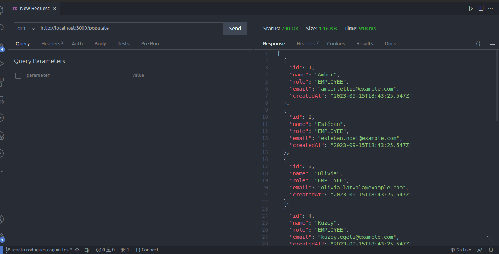
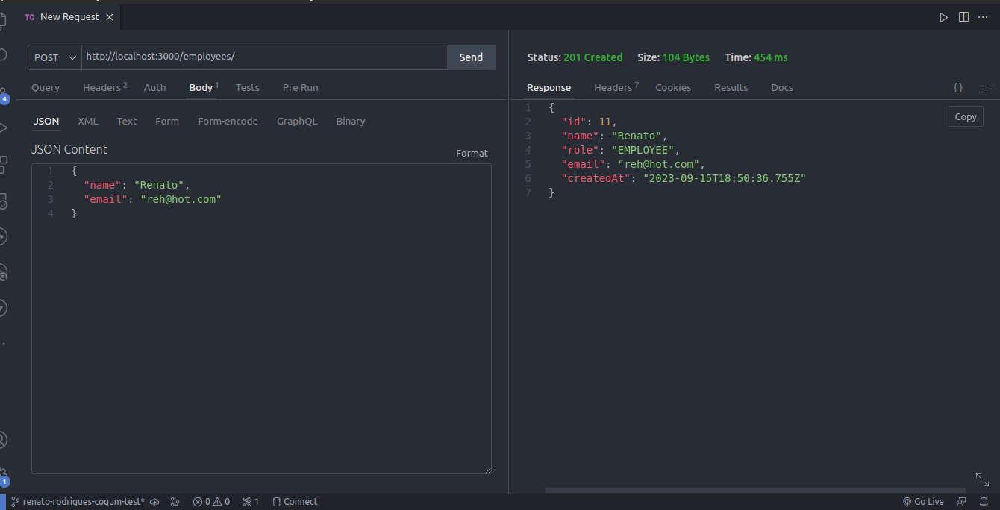
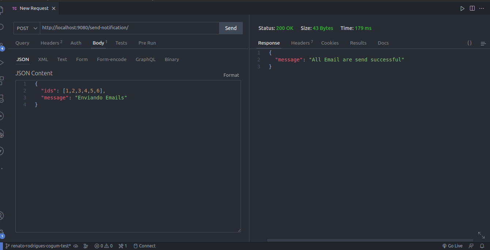
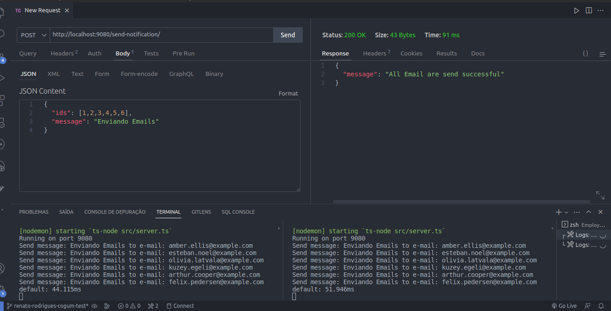
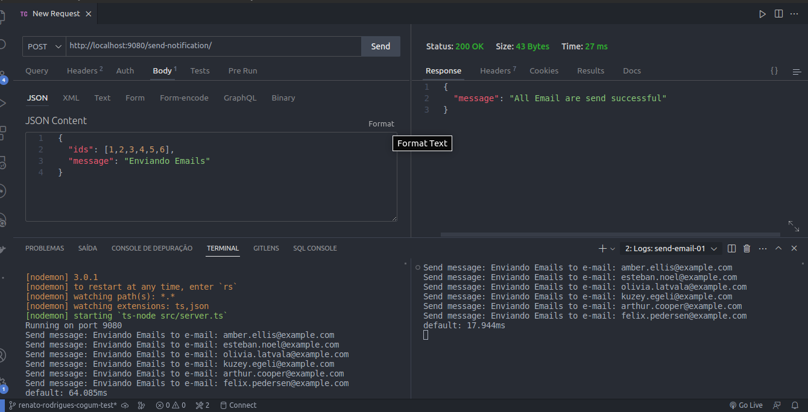
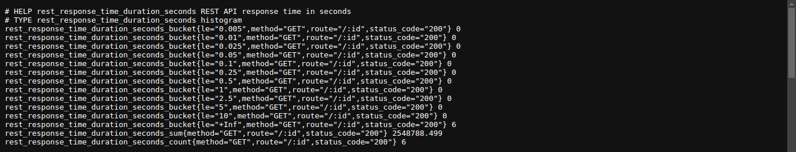
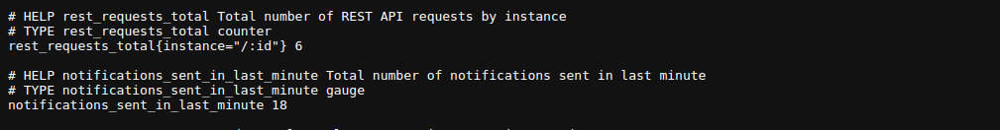

# API Employees

**Listar Employees:** Recupere uma lista de todos os funcionários cadastrados na organização.

**Detalhes de um Employee:** Obtenha informações detalhadas sobre um funcionário específico com base em seu ID.

**Criar Employee:** Adicione um novo funcionário à base de dados da organização fornecendo informações detalhadas, como nome, cargo, e-mail, etc.

**Atualizar Employee:** Atualize as informações de um funcionário existente com base em seu ID.

**Excluir Employee:** Remova um funcionário da base de dados com base em seu ID.

**Send Notification:** Envia notificação com uma mensagem personalizada para uma lista de emails fornecida pelo usuario

## Instalação

Após clonar o repositorio entre dentro da pasta Employee instale as dependencias 
```bash
  npm install 
```
Faça o mesmo na pasta SendEmail
```bash
  npm install 
```
Após instalar as dependencias retorne ao diretorio raiz e suba os containers
```bash
  docker-compose up -d --build 
```
## Ferramentas
* Typescript
* Prisma
* MySQL
* Nginx
* Redis
* Prometheus

## Operações Basicas

Para popular o banco de dados vá até a rota GET /populate



ou crie uma através da rota POST /employees



Para enviar emails utilize a porta 9080 POST /send-notification



## Demonstração de Funcionalidades

A aplicação possui um Load Balancer que aumenta a perfomace e resiliência da aplicação
Se um servidor estiver carregado a requisição é realizada em outro servidor que esteja menos sobrecarregado



A aplicação possui o Redis que diminui consideravelmente o tempo de resposta da aplicação armazenando em cache as informações frenquentemente acessadas



e por último ela também possui um gerenciador de métricas 
Acessado pela porta 3030 /metrics
lá é possivel vizualizar a duração da requisição em cada rota 



a quantitade total que uma rota foi acessada e também a quantidade de notificações enviadas no ultimo minuto 


